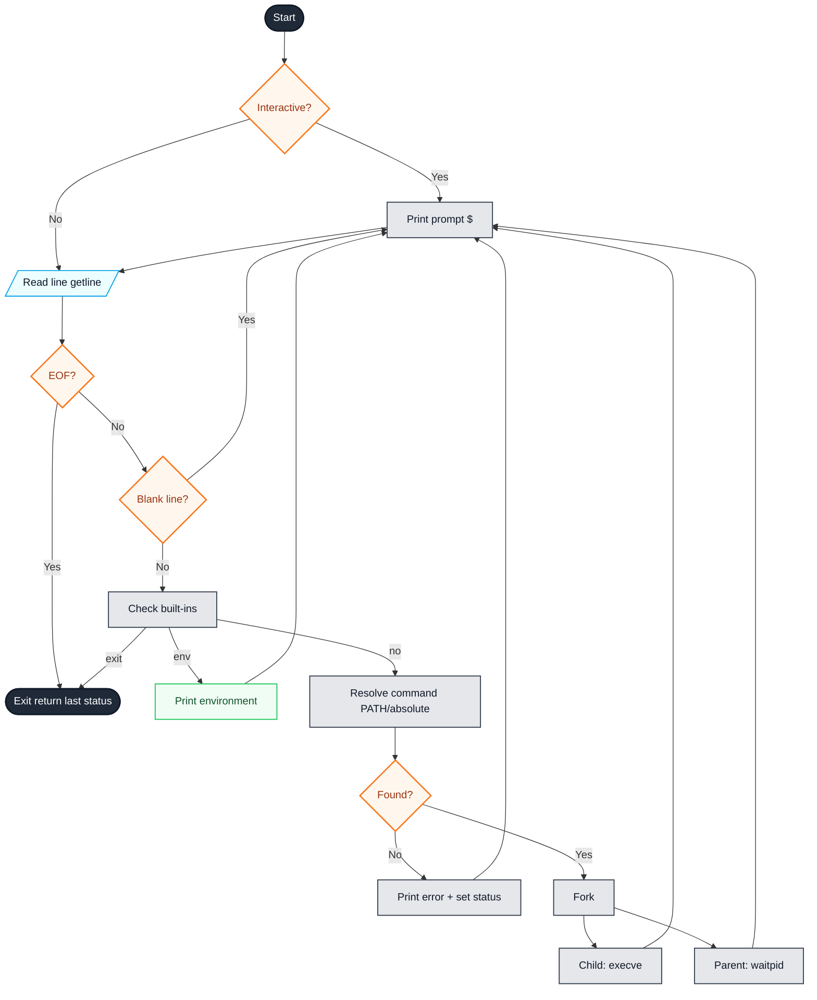

# Simple Shell (`hsh`)

## Table of Contents

- [Introduction](#introduction)
- [Project Goals](#project-goals)
- [Architecture Overview](#architecture-overview)
- [Detailed Program Flow](#detailed-program-flow)
- [Features](#features)
- [Limitations](#limitations)
- [Requirements](#requirements)
- [Compilation and Style](#compilation-and-style)
- [Usage](#usage)
- [Examples](#examples)
- [Files in the Repository](#files-in-the-repository)
- [Functions Description](#functions-description)
- [Error Handling](#error-handling)
- [Exit Status](#exit-status)
- [Flowchart](#flowchart)
- [Authors](#authors)

---

## Introduction

This project is a minimal UNIX command interpreter named `hsh`, written in C, inspired by the behavior of standard shells like `sh` and `bash`.  
The program reads, parses, and executes user commands in a UNIX environment, using system calls and standard C library functions.  
It demonstrates a full loop of reading input, parsing, handling built-in commands, executing external programs, managing processes, and handling the environment.

---

## Project Goals

- Reproduce the main features of a shell from scratch
- Use system calls such as `fork`, `execve`, `waitpid`, `getline`
- Implement simple parsing, argument splitting, and PATH search logic
- Maintain robust resource management (memory, file descriptors)
- Apply clean error reporting and proper exit status handling

---

## Architecture Overview

The shell’s execution logic can be summarized step-by-step:
1. **Prompt display**  
   Shows `($) ` when running interactively.

2. **Command reading**  
   Reads a single line with `getline`.

3. **Blank check**  
   Ignores empty/blank lines (spaces, tabs).

4. **Built-in detection**  
   Handles `exit` (terminate shell) and `env` (print environment variables) as built-ins.

5. **Command parsing and execution**  
   - Tokenizes the line into arguments.
   - Resolves the executable path via absolute path or `PATH` variable lookup.
   - Creates a child process via `fork`.
   - In the child: calls `execve` to run the command.
   - In the parent: waits for the child using `waitpid`.

6. **Error handling**
   - Handles command-not-found, permission denied, and system errors.
   - Outputs errors formatted as:  
     ```
     ./hsh: <line_number>: <command>: <error message>
     ```

7. **Exit on `Ctrl+D` or `exit`**

---

## Detailed Program Flow

- **Startup:**  
  - Determines if STDIN is a terminal with `isatty()`.
  - Initializes state (command counter, last exit status).

- **Main Loop (in `main.c`):**
  - Prompt (`($) `) is printed only in interactive mode.
  - Reads a line with `getline`.
    - If EOF (`Ctrl+D`), exit cleanly.
    - If the line is just whitespace, loop back.
  - Checks for built-ins using `handle_builtin`:
    - If `exit`, returns the last status (ends the shell).
    - If `env`, prints environment variables.
    - Otherwise, proceeds to command execution.
  - Passes the line to `execute_command`.

- **Command Execution (in `execute.c`):**
  - Splits the input line into tokens (arguments).
  - Resolves the command using:
    - Absolute path if argument has `/`
    - Otherwise, searches all directories in `$PATH`
  - Handles not-found and permission errors:
    - `127` for not-found
    - `126` for permission errors
  - Forks a new process:
    - The child calls `execve` on the resolved path.
    - If `execve` fails: error is printed and child exits with the right code.
    - Parent waits for the child's completion (`waitpid`), retrieves and propagates the child’s exit code.

- **Resource Management:**
  - All heap allocations are checked and freed.
  - Duplicated strings, PATH buffers, and argument arrays are cleaned up.

- **End-of-File (`Ctrl+D`):**
  - When `getline` returns -1, shell exits with the last executed command's status code.

---

## Features

- Runs either **interactively** (with a prompt) or **non-interactively** (as part of a pipeline or using a file).
- Recognizes and executes commands given by absolute path (e.g., `/bin/ls`).
- Resolves commands via the `PATH` environment variable.
- Simple argument parsing: tokens are separated by spaces or tabs.
- Built-in commands: `exit`, `env`
- Graceful handling of end-of-input (Ctrl+D).
- Returns the exit status of the last executed command.

---

## Limitations

- No support for advanced shell syntax:
   - No pipes (`|`), redirections (`<`, `>`), semicolons (`;`), quotes, or wildcards.
- The built-in `exit` does not accept an argument (exit codes must be inherited).
- No environment variable modification (`setenv`, `unsetenv`).
- No command chaining or logical operators (`&&`, `||`).
- No command history, job control, or scripting abilities.

---

## Requirements

- Ubuntu 20.04 LTS
- GCC with flags: `-Wall -Werror -Wextra -pedantic -std=gnu89`
- C90 (GNU89) coding standard
- [Betty style](https://github.com/holbertonschool/Betty) compliance
- No memory leaks (tested with `valgrind`)

---

## Compilation and Style

To compile all source files into the `hsh` binary:
```bash
gcc -Wall -Werror -Wextra -pedantic -std=gnu89 *.c -o hsh
```
Make sure your code passes Betty checks and all heap allocations are released.

---

## Usage

### Interactive mode
```bash
./hsh
```
- Displays the `($) ` prompt and waits for user input.

### Non-interactive mode
```bash
echo "/bin/echo hello world" | ./hsh
```
- Executes commands from standard input, processes without prompt.

---

## Examples

#### Interactive
```text
$ ./hsh
($) /bin/ls
file1  file2  main.c
($) env
PATH=/usr/local/sbin:/usr/local/bin:/usr/sbin:/usr/bin:/sbin:/bin
HOME=/home/julien
($) exit
$
```

#### Non-interactive
```text
$ echo "env" | ./hsh
PATH=/usr/local/sbin:/usr/local/bin:/usr/sbin:/usr/bin:/sbin:/bin
HOME=/home/julien
```

---

## Files in the Repository

| File            | Purpose / Key Functions                                                      |
|-----------------|------------------------------------------------------------------------------|
| `main.c`        | Shell entry point, main loop, prompt, command reading and dispatch           |
| `builtins.c`    | Implementation of built-in commands: `exit`, `env`                          |
| `main.h`        | Project-wide header with function prototypes and includes                    |
| `execute.c`     | Argument parsing, command execution, fork/execve/waitpid, error propagation  |
| `path.c`        | PATH resolution, command permission checks, error messages                   |
| `README.md`     | Complete documentation (this file)                                           |
| `man_1_simple_shell` | UNIX manual page for `hsh`                                              |
| `flowchart.mmd` | Mermaid diagram for shell execution flow                                     |

---

## Functions Description

- `main()` *(`main.c`)*  
  Sets up the shell loop, invokes prompt, reads input line by line.

- `handle_builtin(line, last_status, &handled, &should_exit)` *(`builtins.c`)*  
  Checks if the line matches a built-in command and executes it.

- `execute_command(line, prog_name, count)` *(`execute.c`)*  
  Tokenizes input, resolves executable path, forks, executes command, waits for child, handles all system errors.

- `resolve_command(command, &status, &msg)` *(`path.c`)*  
  Returns a malloc'd path to the executable if found (either absolute or in `$PATH`), and gives the right exit code/message for failure.

- `print_exec_error(prog_name, count, command, msg)` *(`path.c`)*  
  Prints errors in the shell-like format.

- Other helper functions are static and exist for internal logic, such as blank-line detection and dynamic array management.

---

## Error Handling

All error conditions (command not found, permission denied, argument errors, memory allocation failures, fork/exec failures) print an informative message and return a well-defined exit code.

Examples:
- **Command not found:** 127
- **Permission denied:** 126
- **General system errors:** 1
- **Shell exit:** Last executed status

---

## Exit Status

`hsh` always returns the exit status of the last executed external command or built-in.  
This enables its use in scripts and pipelines where exit status is significant.

---

## Flowchart

The following diagram illustrates the exact flow implemented in the codebase (see `flowchart.mmd` for the Mermaid source):


If your platform (e.g. GitHub or Markdown viewer) supports Mermaid, here is the diagram source:



---

## Authors

- Aleksandre Loladze <aloladze88@gmail.com> 
- Nicolas Jacquemin <nicolas.jacquemin26@gmail.com>

---
